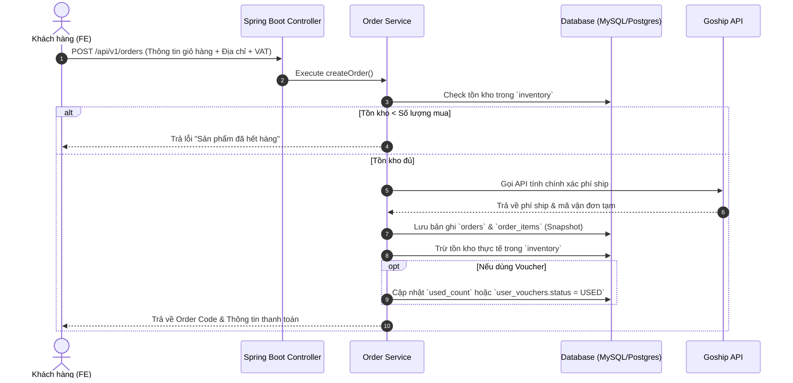
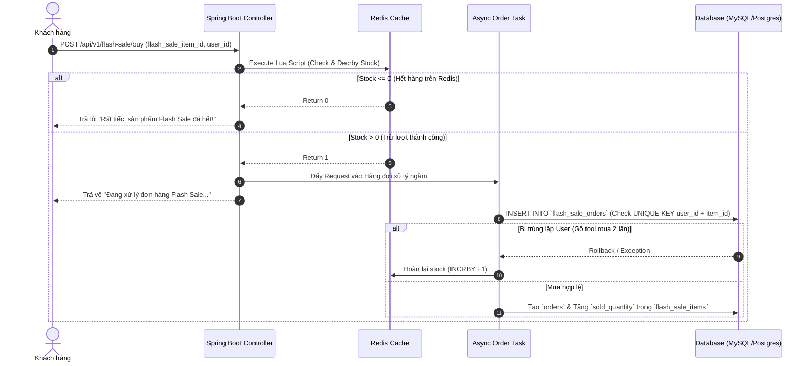
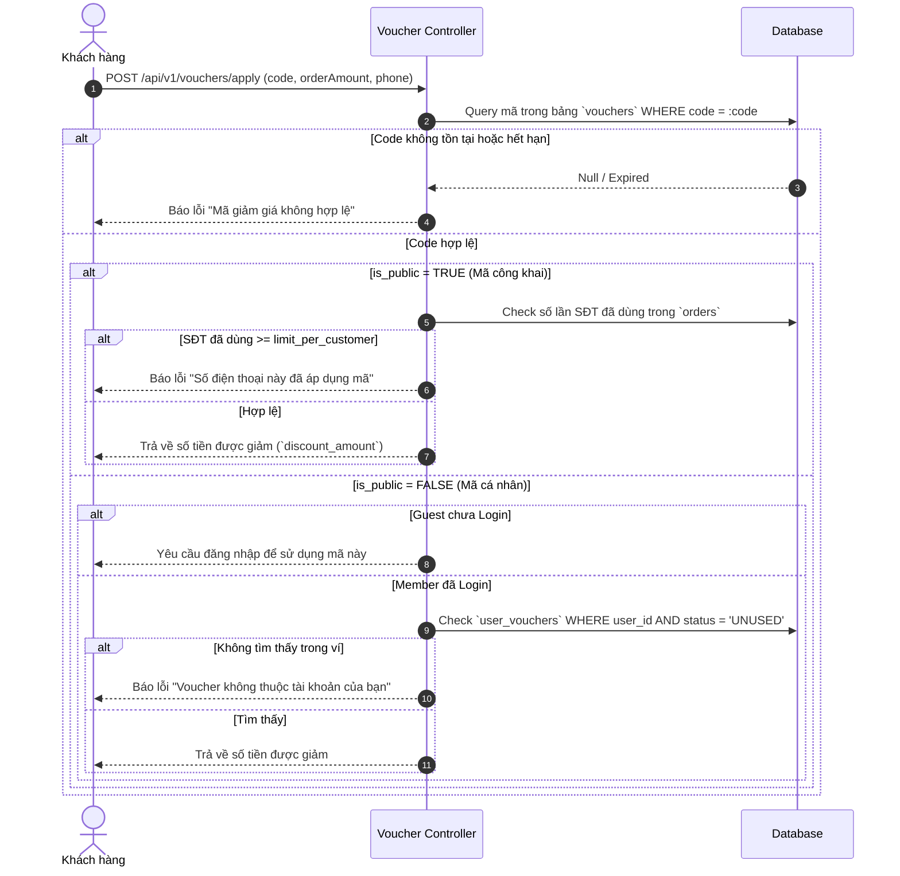
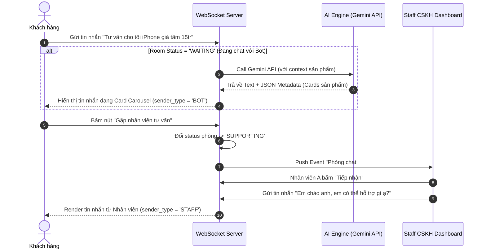

```markdown
# 🔄 BUSINESS FLOW & SEQUENCE DIAGRAMS

Tài liệu này mô tả chi tiết các luồng xử lý nghiệp vụ chính trong hệ thống **TechStore** bằng sơ đồ tuần tự (Sequence Diagram) và quy trình xử lý phía Backend.

---

## 1. LUỒNG ĐẶT HÀNG & TRỪ TỒN KHO (ORDER & STOCK RESERVATION)

Áp dụng cho cả khách hàng đã đăng nhập (**Member**) và khách mua nhanh (**Guest**).



---

## 2. LUỒNG MUA HÀNG FLASH SALE CHỊU TẢI CAO (HIGH-CONCURRENCY FLASH SALE)

Sử dụng **Redis Lua Script** để kiểm tra và trừ lượt Atomic trên RAM trước khi chạm xuống CSDL.



---

## 3. LUỒNG ÁP DỤNG MÃ GIẢM GIÁ (PUBLIC VS PRIVATE VOUCHER)

Phân định rõ ràng cách xử lý mã Public (nhập tay) và mã Private (Ví Voucher).



---

## 4. LUỒNG LIVE CHAT TƯ VẤN (HYBRID AI CHATBOT & HUMAN AGENT)

Chuyển đổi linh hoạt giữa Trợ lý AI và Nhân viên CSKH thực tế qua WebSocket.



```

```