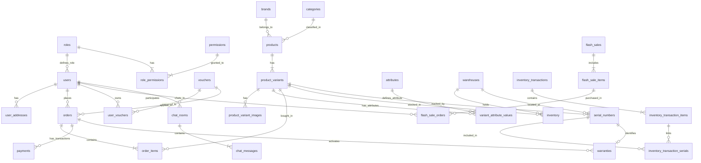

```markdown
# 🗄️ DATABASE DESIGN DOCUMENTATION

Tài liệu này chi tiết hóa cấu trúc Cơ sở Dữ liệu (CSDL) Quan hệ (RDBMS) của hệ thống **TechStore**, bao gồm Sơ đồ ERD, đặc tả bảng chi tiết, chiến lược đánh Index và các giải pháp bảo toàn tính toàn vẹn dữ liệu.

---

## 1. SƠ ĐỒ QUAN HỆ THỰC THỂ (ERD DIAGRAM)

Dưới đây là sơ đồ tổng quan mối quan hệ giữa các bảng cốt lõi trong hệ thống:



---

## 2. ĐẶC TẢ CHI TIẾT BẢNG CSDL (SCHEMA DEFINITION)

### 2.1. Phân quyền & Người dùng (RBAC & Users)

* **`roles`**: Định nghĩa các vai trò chính trong hệ thống (`ADMIN`, `STAFF`, `WAREHOUSE`, `USER`). Mối quan hệ `@ManyToOne` trực tiếp với `users`.
* **`permissions` & `role_permissions**`: Lưu danh sách quyền chi tiết theo từng module (Ví dụ: `order.update`, `warehouse.scan_imei`).
* **`users`**: Tài khoản người dùng hệ thống. Hỗ trợ cả đăng nhập truyền thống (`password` + `provider = 'LOCAL'`) và Đăng nhập Mạng xã hội OAuth2 (`provider = 'GOOGLE' / 'FACEBOOK'` đi kèm `provider_id`). Cột `password` cho phép `NULL` đối với tài khoản Social Login hoàn toàn.
* **`password_resets`**: Quản lý mã OTP khôi phục mật khẩu qua Email với số lần thử tối đa và thời hạn hết hạn.
* **`user_addresses`**: Sổ địa chỉ giao hàng cá nhân (Chứa cả địa chỉ dạng text và các mã hành chính `province_id`, `district_id`, `ward_code` để tích hợp API tính phí ship Goship/GHN).

### 2.2. Sản phẩm & Thuộc tính động (EAV Pattern)

* **`brands` & `categories**`: Thương hiệu và danh mục sản phẩm (Hỗ trợ danh mục đa cấp qua `parent_id`).
* **`attributes` & `variant_attribute_values**`: Áp dụng mô hình **Entity-Attribute-Value (EAV)** để lưu thông số kỹ thuật động linh hoạt cho đồ điện tử (RAM, ROM, Chipset, Màn hình...).
* **`products`**: Thông tin sản phẩm master (Tên, hãng, danh mục, mô tả chung, thời gian bảo hành).
* **`product_variants`**: Các phiên bản/SKU bán hàng thực tế có giá vốn, giá bán và màu sắc/dung lượng riêng (VD: *iPhone 15 Pro Max 256GB Titan Tự Nhiên*).
* **`product_variant_images`**: Lưu danh sách hình ảnh của từng phiên bản sản phẩm.

### 2.3. Chương trình Khuyến mãi (Vouchers & Flash Sale)

* **`vouchers`**:
* `is_public = TRUE`: Mã giảm giá công khai hiển thị ở trang Checkout cho mọi người dùng.
* `is_public = FALSE`: Mã giảm giá độc quyền lưu trong Ví Voucher cá nhân.


* **`user_vouchers`**: Quản lý Ví Voucher thành viên (`status`: `UNUSED`, `USED`, `EXPIRED`), liên kết `user_id`, `voucher_id` và `order_id` khi áp dụng.
* **`flash_sales` & `flash_sale_items**`: Quản lý chiến dịch Flash Sale theo khung giờ vàng và số lượng giới hạn cho từng SKU.
* **`flash_sale_orders`**: Bảng ghi nhận giao dịch mua Flash Sale. Ràng buộc **`UNIQUE KEY uk_user_flash_item (flash_sale_item_id, user_id)`** ngăn chặn triệt để hành vi dùng tool/script spam mua nhiều lần ở tầng CSDL.

### 2.4. Đơn hàng, Vận chuyển & Thanh toán

* **`carts` & `cart_items**`: Giỏ hàng hỗ trợ cả người dùng đăng nhập (`user_id`) lẫn khách vãng đặt hàng qua session (`session_id`).
* **`orders`**: Áp dụng cơ chế **Snapshot Data** (Lưu cứng thông tin người nhận, địa chỉ, email và thông tin hóa đơn VAT tại thời điểm chốt đơn để đảm bảo tính pháp lý và báo cáo kế toán khi master data thay đổi).
* **`order_items`**: Chi tiết sản phẩm và đơn giá tại thời điểm đặt hàng.
* **`payments`**: Lưu lịch sử giao dịch cổng thanh toán online (VNPay, MoMo, COD) với cột `provider_transaction_id` phục vụ đối soát và `gateway_response JSON` lưu chi tiết phản hồi Webhook.

### 2.5. Kho hàng, Quản lý IMEI/Serial & Bảo hành Điện tử

* **`warehouses` & `inventory**`: Quản lý danh sách kho (`KHO_HN`, `KHO_HCM`) và số lượng tồn kho khả dụng của từng SKU.
* **`inventory_transactions` & `inventory_transaction_items**`: Quản lý phiếu nhập kho, xuất kho và chuyển kho giữa các chi nhánh.
* **`serial_numbers`**: Định danh chính xác từng thiết bị điện tử thực tế bằng **Mã IMEI / Serial Number** kèm trạng thái (`in_stock`, `reserved`, `sold`, `defective_returned`).
* **`inventory_transaction_serials`**: Bảng trung gian liên kết các mã IMEI/Serial cụ thể được xuất/nhập trong từng dòng phiếu giao dịch kho.
* **`warranties`**: Bảo hành điện tử tự động kích hoạt ngay khi đơn hàng giao thành công (`DELIVERED`), tra cứu qua IMEI/Serial (`serial_id`) hoặc SĐT người mua.

### 2.6. Đánh giá Sản phẩm & Hỗ trợ Live Chat

* **`reviews` & `review_images**`: Quản lý đánh giá sao ($1 \rightarrow 5$) và hình ảnh thực tế từ người mua.
* **`chat_rooms`**: Phòng chat trực tuyến giữa Khách hàng (`user_id` hoặc `guest_session_id`) với Nhân viên CSKH (`staff_id`).
* **`chat_messages`**: Lưu lịch sử tin nhắn real-time (Hỗ trợ gửi Text, Ảnh sản phẩm hoặc Card tư vấn từ AI Bot).

---

## 3. CHIẾN LƯỢC ĐÁNH INDEX (INDEXING STRATEGY)

Các Index được thiết kế tối ưu cho tốc độ đọc (Read Operations) và tra cứu thường xuyên mà không làm suy giảm hiệu năng ghi:

| Bảng | Cột Đánh Index | Loại Index | Mục đích Sử dụng |
| --- | --- | --- | --- |
| `users` | `(provider, provider_id)` | Composite Index | Tra cứu siêu tốc người dùng khi Đăng nhập bằng Social Login (Google/FB) |
| `vouchers` | `(code, start_date, end_date)` | Composite Index | Validate tính hợp lệ của mã giảm giá tại bước Checkout |
| `orders` | `code` | Unique Index | Tra cứu chi tiết đơn hàng theo Mã Đơn |
| `orders` | `(user_id, created_at)` | Composite Index | Render lịch sử đơn hàng của User theo thứ tự thời gian mới nhất |
| `inventory` | `(variant_id, quantity)` | Composite Index | Kiểm tra tồn kho nhanh khi khách thêm vào giỏ / đặt hàng |
| `serial_numbers` | `(variant_id, status)` | Composite Index | Truy vấn nhanh danh sách IMEI sẵn sàng xuất kho (`in_stock`) |
| `chat_messages` | `(room_id, created_at)` | Composite Index | Tải lịch sử tin nhắn phòng chat real-time theo thứ tự thời gian |

---

## 4. BẢO TOÀN DỮ LIỆU & RÀNG BUỘC (DATA INTEGRITY & CONSTRAINTS)

1. **Foreign Key Restraints (Khóa ngoại):**
* Xóa tài khoản (`users`): Ràng buộc `ON DELETE CASCADE` tự động dọn dẹp `user_addresses`, `user_vouchers`.
* Hủy tham chiếu an toàn: Các bảng lịch sử như `orders.user_id`, `orders.voucher_id` áp dụng `ON DELETE SET NULL` để không làm mất báo cáo doanh thu tài chính khi xóa master record.


2. **Snapshot Mechanism (Chụp ảnh dữ liệu):**
* Đơn giá sản phẩm (`order_items.price`), phí vận chuyển (`orders.shipping_fee`), địa chỉ giao hàng và thông tin xuất hóa đơn VAT được sao chép nguyên trạng vào bảng `orders` tại thời điểm tạo đơn.


3. **Concurrency & Race Condition Control:**
* Chống over-selling và mua trùng đợt Flash Sale bằng ràng buộc `UNIQUE KEY uk_user_flash_item (flash_sale_item_id, user_id)` kết hợp với Redis Atomic Counter ở tầng application.


```

```